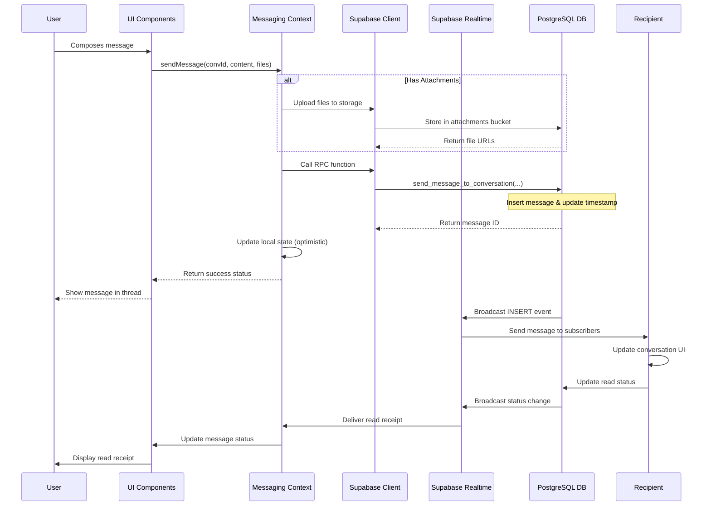
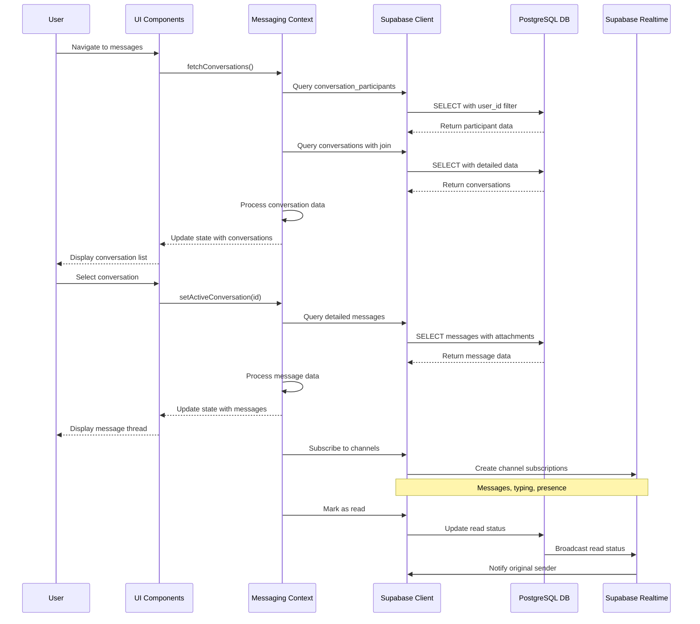
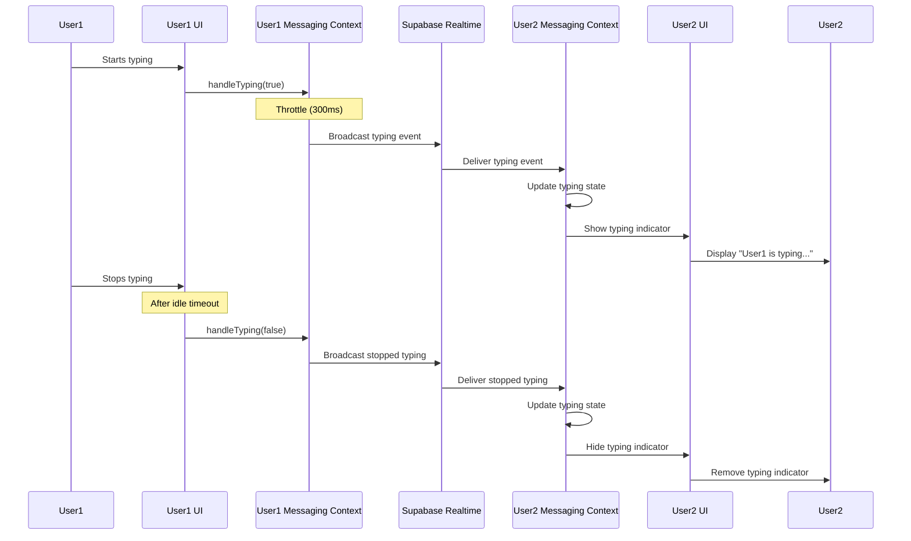
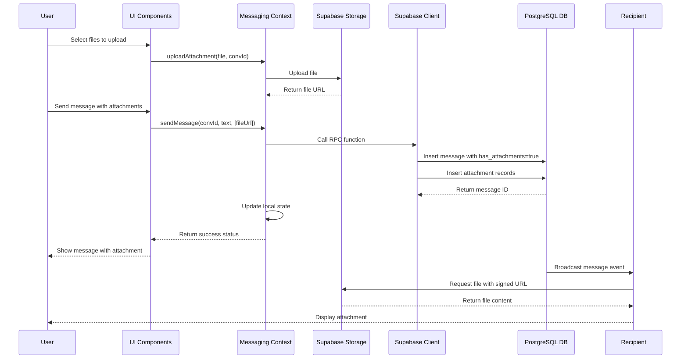
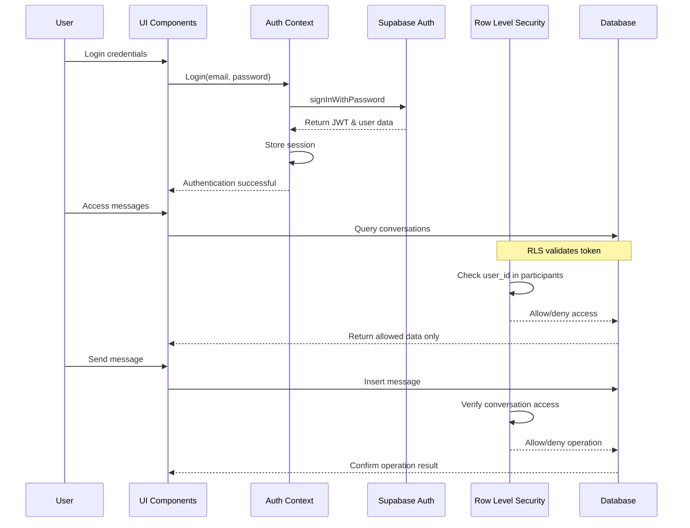
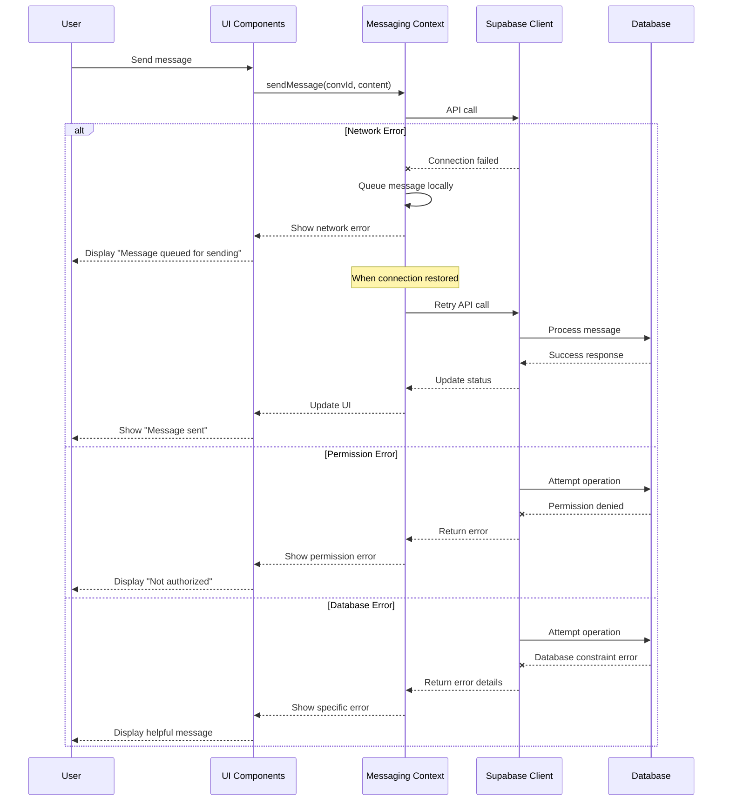
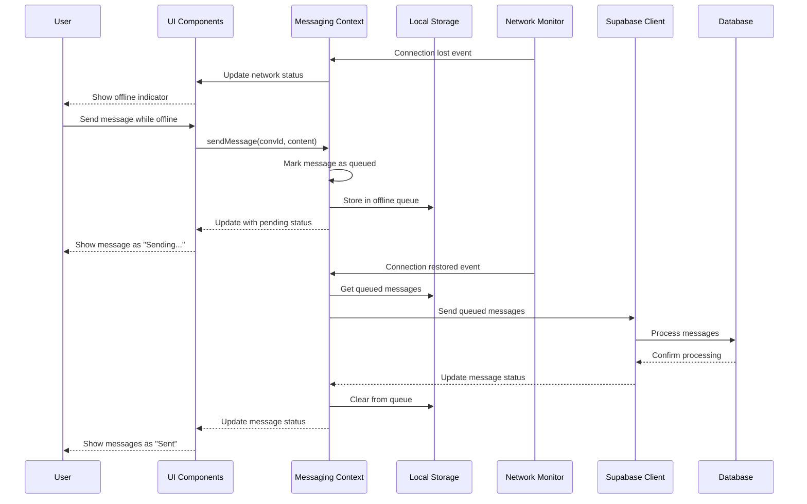
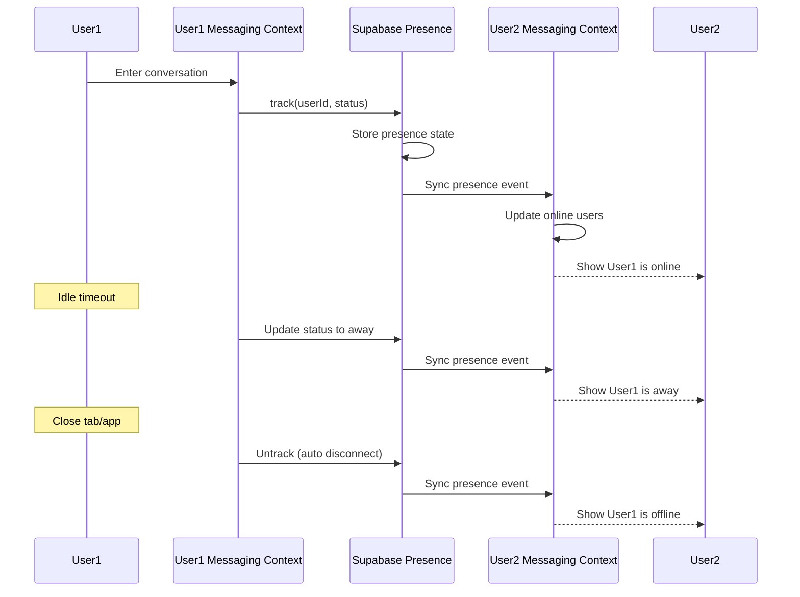

# Messaging System Sequence Diagrams

## Core User Interactions

This document provides sequence diagrams that illustrate the key interactions within the messaging system.

### Message Sending Sequence

### Conversation Loading Sequence

### Typing Indicator Sequence

### Attachment Handling Sequence

## Authentication and Authorization Flow

## Error Handling Flow

## Offline Support Sequence

## Real-time Presence Management

